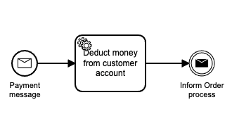
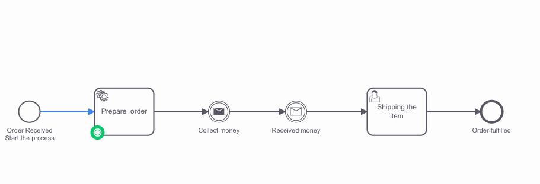
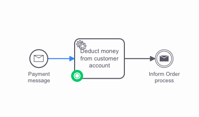
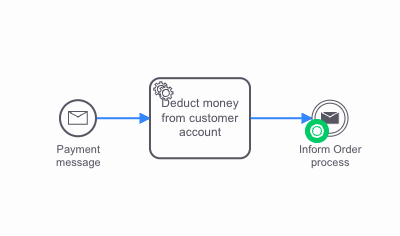

# Zeebe Message Correlation

Message correlation is a powerful feature in Zeebe. It allows you to target a running workflow with a state update from an external system asynchronously. 

This tutorial we model a order process and paymnet process 

order process will user message intermediate throw event element to active second process which is payment process and at the end of the payment process will notifiy order process via sending the message . 

This tutorial uses the typescript client, but it serves to illustrate message correlation concepts that are applicable to all language clients.


If you are doing this exercise on Camunda Cloud, remember to set the environment variables with your client credentials in each terminal window; and you will use Operate in your Camunda Cloud cluster.

## Workflow




Use the [Camunda Modeler](https://camunda.com/download/modeler/) to open the [order process](bpmn/order-process-arezoo.bpmn) and [payment process](bpmn/payment-process-arezoo.bpmn)files in this project. 

Click on the message start event to see how it is configured:


this name is important cause all Message Start events that match the name property will receive the message.

 can use the publishStartMessage() method to publish a message


A crucial piece here is the _Subscription Correlation Key_. In a running instance of this workflow, an incoming "_Money Collected_" message will have a `correlationKey` property:

```typescript
 zbc.publishStartMessage({
        name: "Money-Collected",
        variables: {
          "orderId":orderId
        },
        timeToLive: 600000
      });
```

 The concrete value of the message `correlationKey` is matched against running workflow instances, by comparing the supplied value against the `orderId` variable of running instances subscribed to this message. This is the relationship established by setting the correlationKey to `orderId` in the message catch event in the BPMN.

## Running the demonstration

 - Clone this repository.

 - Install dependencies:
 ```
 npm i && npm i -g ts-node typescript
 ```


 - Deploy the workflow and start an instance:
 ```
 ts-node start-workflow.ts
 ```
This starts a workflow instance with the `orderId` set to random number:
 ```typescript
  await zbc.createProcessInstance("arezo-order-process-", {
      orderId: Math.floor(Math.random() * 1000) + 1,
      customerId: 123,
      paymentStatus: "unpaid",
    })
  );
}
 ```

 - Now open operate at [http://localhost:8080](http://localhost:8080)

 - Click on the workflow instance. You will see the current state of the workflow:

 


You can see that this workflow instance has the variable `orderId` set to the random value value .

- Now start the workers:
```
ts-node prepair-order-worker.ts 
```
- Refresh operate to see the current state of the workflow:


- Now start the worker for throw message:
```
ts-node sendMessage-startPaymentProcess-.ts  

```
back to operate and you should be able to see the Payment process start 
You will see the current state of the workflow:

 


Now all the start message with the name collect-Money will start


- Now start the worker for deduct money:
```
ts-node ts-node deduct-money.ts    

```
 


Now the token is at the message catch event, waiting for a message to be correlated.

 


- Take a look at the "Message Subscriptions" tab:

You can see that the broker has opened a message subscription for this workflow instance with the concrete value of the `orderId` . This was created when the token entered the message catch event.

- Now send the message, in another terminal:
```
ts-node ts-node sendMessage-to-orderProcess.ts 
```

- Refresh the page, and you see that the message has been correlated and the workflow for paymnet process has run to completion:


back to order process, you will see the message catch event,and the message has been correlated catched the message and payment variable value changed to paied which was send from payment process and token went to next worke


now open the tasklist complet the job and then you will see that order process also run to completion.


